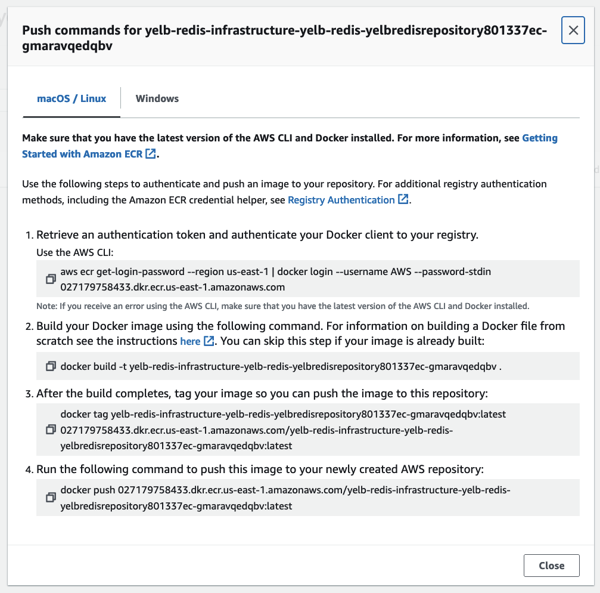

# Usage

## Clone the workshop repository and deploy the lab's CloudFormation stack
```
git clone https://github.com/aws-samples/cicd-for-ecs-workshop-code.git

aws cloudformation deploy \                                   
  --stack-name prod-cluster \                           
  --template-file cicd-for-ecs-workshop-code/setup/Cluster-ECS-EC2-2AZ-ALB-1NAT.yaml \
  --capabilities CAPABILITY_IAM \
  --parameter-overrides "EnvironmentName=prod" \
  --parameter-overrides "InstanceType=m5.xlarge"
```

## Clone this repository
```
git clone https://github.com/fibert/yelb.git
cd yelb
```

## Install requirements

```
python -m venv .venv
source ./.venv/bin/activate

npm ci
pip install -r requirements.txt
pip install -r requirements-dev.txt
```

## Deploy 
```
npx cdk deploy
```
This creates:
1. Service discovery namespace
2. For each of `Yelb-UI`, `Yelb-Appserver`, `Yelb-DB`, and `Yelb-Redis`:
   1. A generated CDK application code
   2. A CodeCommit repository


## Initialize CodeCommit repositories
### Clone the repositories
```
cd ..
export AWS_REGION=$(aws configure get region)
git clone codecommit::$AWS_REGION://yelb-ui
git clone codecommit::$AWS_REGION://yelb-appserver
git clone codecommit::$AWS_REGION://yelb-db
git clone codecommit::$AWS_REGION://yelb-redis
```

### Initialize working directories

```
for component in yelb-ui yelb-appserver yelb-db yelb-redis
do
  cd $component
  cp -r ../yelb/generated/$component/ .

  git add .
  git commit -m "Initial commit"
  git push origin main

  python -m venv .venv
  source ./.venv/bin/activate

  npm ci && \
  pip install -r requirements.txt && \
  pip install -r requirements-dev.txt

  cd ..
done
```
## For each component (`yelb-ui`, `yelb-appserver`, `yelb-db`, and `yelb-redis`) do
#### List stacks
```
cd {component}
npx cdk ls
```

#### Deploy stack
```
npx cdk deploy {Stack name from `ls` command}
```

#### While stack is deploying
**In a new terminal run**
```
cd runtime
```

Go to [ECR Console](https://us-east-1.console.aws.amazon.com/ecr/repositories)

Go to the newly created ECR repository for the component, click on **View push commands**

Excecute the commands to push a container image into the repository:

