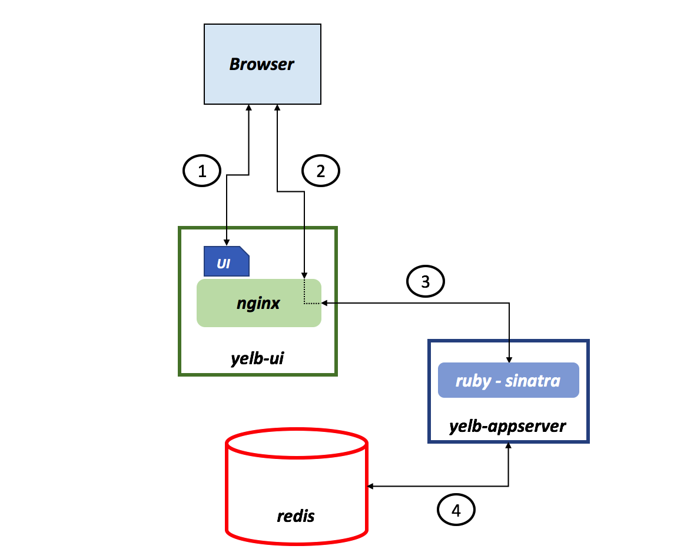
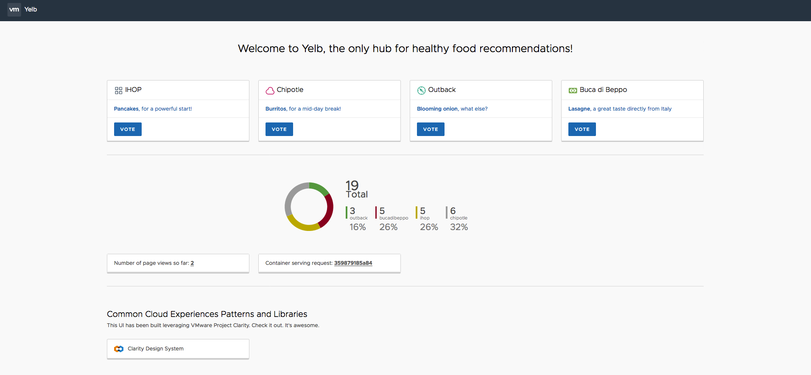

#### Why Yelb 

Yelb is an app I wrote from scratch (leveraging existing frameworks and tools such as Sinatra, Clarity and others). 

I have built it for a couple of reasons: 

- while there are dozens of demo/test apps out there, I think that having an app that you know 100% end-to-end and that you know inside out is something useful (if nothing, you will learn/experience one or more programming languages) 
- building a set of assets to deploy a "real" application on multiple platforms (e.g. Docker, Kubernetes, Rancher, CloudFoundry, OpenShift, ECS, Serverless etc etc). Owning the application itself makes this task easier, more useful and more interesting. Also, using target platforms specific examples isn't quite like the challenge of having to think about how to adapt an existing application to be able to deploy it on a specific target platform.   

As far as reason #1 goes, I found very interesting dealing with the challenges (at the edge of dev and ops duties) of starting and coordinating the application modules in specific environments (development, test, production). This is often achieved in specific programming environments leveraging system variables (e.g. RACK_ENV for ruby, other mechanisms for Angular2, etc). You will see some of these configurations in actions in the `localdevelopment` and `localtest` instructions (inside the `deployments` folder). Building an application from scratch and packaging it using Docker while honoring this flexibility is a very interesting (learning) exercise.

#### Yelb architecture

The current architecture layout is pretty straightforward. 

There is a front-end component called `yelb-ui` that fullfills a couple of roles (they could even be split if need be). The first role is to host the Angular 2 application (i.e. the UI of the Yelb application). When the browser connects to this layer it downloads the `Javascript` code that builds the UI itself. Subsequent requests and calls to other application components are proxied via the `nginx` service running on `yelb-ui`. 

At the time of this writing the only application component that exists is `yelb-appserver`. This is a Sinatra application that basically read and write to a cache server (`redis-server`) as well as a Postgres backend database (`yelb-db`). Redis is used to store the number of page views whereas Postgres is used to persist the votes. Note that the `yelb-db` container image is nothing more than Postgres (10) customized to create the database schema the application relies on.   

The picture below shows the architecture of Yelb:

#### What does Yelb do?

Yelb allows users to vote on a set of alternatives (restaurants) and dynamically updates pie charts based on number of votes received. In addition to that Yelb keeps track of number of page views as well as it prints the hostname of the `yelb-appserver` instance serving the API request upon a vote or a page refresh. This allows an individual to demo the application solo, or involving people (e.g. an audience during a presentation) asking them to interact by pointing their browser to the application (which will increase the page count) and voting their favorite restaurant.    

This is how the UI looks like at this point:

The nature of the app allows people to experiment with the statless `yelb-ui` and `yelb-appserver` components (think scaling out, blue/green depoyments, etc.) as well as experiment with the stateful `redis-server` and `yelb-db` backend components. 

#### How can I use it?

If you intend to contribute, fork or understand anyway how the single components work I suggest you dig into each of them looking at the code (and the various dockerfiles) to learn how they work and how they are packaged. In addition to that you should look into the `deployments` folder how to start the application in development mode and test mode.  

If you intend to use Yelb as a generic application with the ultimate goal of learning and playing with multiple platforms (from cloud instances, to containers through potentially serverless), then you should probably go straight into the `deployments` folder and specifically in the `platformdeployment` folder. This is where all the various configuration files for the various platforms exist (or will exist). This folder will ideally be a continuous work in progress. 

#### Known issues and limitations

- There is a subtle issue when you browse the app for the first time where the browser console shows errors. This is likely due to problems with variables not initialized properly. This needs further investigation. The app works just fine and there is no evidence of the problem unless you inspect the page and go to the console outputs.   
- There is a ton of optimization that could be achieved both in the application code as well as in the packaging constructs (e.g. Dockerfiles). The package in its current form works but it is far from being considered optmized.
- Idempotency may be a problem. While I am trying to explicitly declare container tags and modules versions moving forward, there is a chance that if you try to build your own containers from the Dockerfile provided and/or install the project on a cloud instance, the output may be diverging from one setup to another. Generic `apt-get update`, `npm install` `gem install sinatra` instructions may lead to different versions of code and modules being pulled at build and setup times.
- The cache instance is still named `redis-server` (this will be renamed `yelb-cache` in the future for consistency)
- While the intent was to build an application whose layers could scale out (and scale independently) in a classic microservices scenario, very little testing has gone into scale out deployment scenarios so far. Most of the tests have been done with one (1) instance of service per layer.
