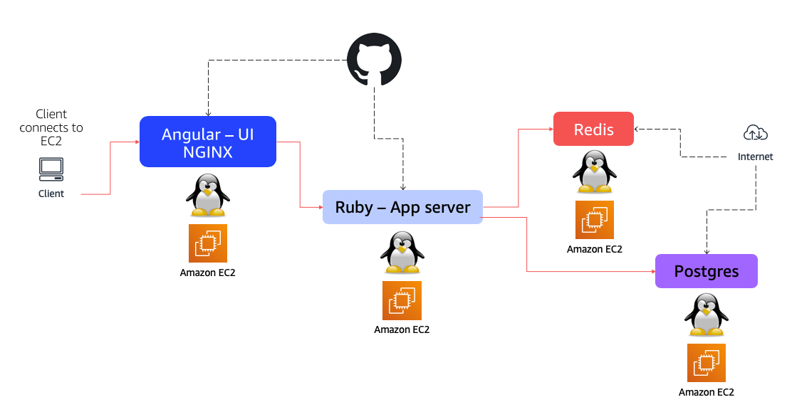

These are sample AWS Cloudformation templates. These are provided as basic examples. They leverage the generic Linux scripts available [here](https://github.com/mreferre/yelb/tree/master/deployments/platformdeployment/Linux). These templates only work in selected regions (those for which mappings to proper AMIs has been explicitly included). Should you need to run them in other regions, you can map the Amazon Linux AMI for that region.  

Please not that these scripts compile the Angular UI at deployment time. That is to say, Cloudformation will assume the (infrastructure) deployment is complete while, in reality, the instance hosting the UI is likely still compiling. It may take some 5 to 10 minutes before the application will start responding at the URL in the output of the CFN stack (which represents the instance where the Yelb UI is deployed).  

This is a visual representation of the distributed deployment: 

 

Note: this deployment doesn't implement any well architected best practice and is only provided as a proof of concept. 

The single instance deployment only deploys a single EC2 instance with all the modules on it. 