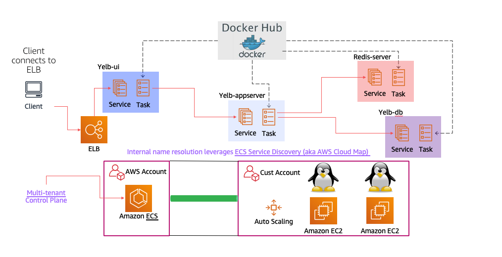
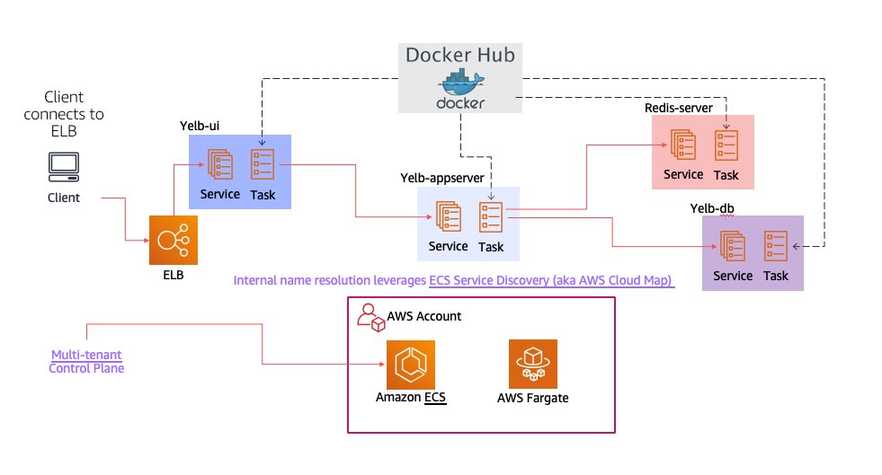

In this folder there are Cloudformation, Copilot, Terraform and CDK artifacts to deploy Yelb on Amazon ECS.

The CFN template(s) allows to deploy on both Amazon EC2 as well as AWS Fargate on existing cluster and VPCs. 

The CDK code and the Copilot manifests allow to deploy on AWS Fargate only and they create a dedicated ECS cluster and VPC. 

The Terraform code has been contributed by [pkilpo](https://github.com/pkilpo) (thanks!) and takes a slightly different approach in that it wraps all images into a single ECS task and ECS service. 

They are provided as basic examples of how to deploy Yelb on ECS. 

This is a visual representation of the ECS/EC2 deployment: 

 

This is a visual representation of the ECS/Fargate deployment: 

 
