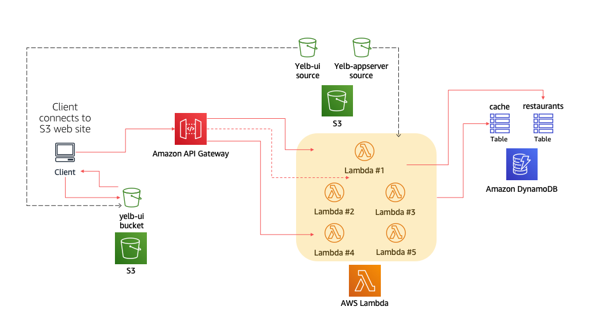

The code in this directory includes *experimental* support for running the Yelb application "serverless". Note that the script only works for the Oregon region (`us-west-2`) mostly because the bucket the Lambda functions grab the zip from is located there (and Lambda only supports grabbing the code from the same region).  

The `deploy-yelb-s3-lambda-ddb.sh` script brings to life a stack that is comprised of the Yelb appserver (turned into discrete Lambda functions fronted by an API Gateway) as well as the back end persistency layer (turned into two separate DybamoDB tables). 

This required a small refactor of the Yelb appserver code. First I decoupled the "application logic" from the coreography of the framework (for lack of a better definition). Now the `yelb-appserver.rb` file is there to support the Sinatra franework and the logic has been moved to separate modules. Similarly, all the Lambdas are created using a specific adapter (formatted in the way Lambda requires to call the function) but then they call the business logic in the various modules (the same modules that `yelb-appserver.rb` calls). A similar pattern is described [here](https://medium.com/datreeio/writing-portable-serverless-applications-252fd8623bce).

In addition to the above, support for DynamoDB has been added to the business logic. Now when the appserver code is started passing the variables `yelbddbrestaurants` and `yelbddbcache` the code will persist data to the two DDB tables (instead of the Postgres DB and the Redis server). 

The script runs a CF template (`deploy-yelb-lambda-ddb.yaml`) that stands up the tables, the Lambdas and the API Gateway. In addition to this the script also sources and tweaks the Yelb UI (hosted on an S3 public bucket) and eventually it deploys it on a newly created S3 bucket (with the Web Hosting configuration configured).

Ideally (and ambitionally), this script should be turned into a single CDK template that does all of this. 

The artifact for the Lambdas is available here: `s3://yelb-appserver-serverless/yelb-appserver-serverless.zip`.
The artifact for the S3 site is available here: `s3://yelb-ui-serverless`.

These artifacts are created using build stages that are executed manually and that refresh that content. 

Not specifically serverless but, in addition to the `deploy-yelb-lambda-ddb.yaml` CF template, there is another template (`deploy-yelb-lambda-pg-redis.yaml`) that stands up a Lambda stack with Postgres and Redis (instead of the two DynamoDB tables). The `deploy-yelb-s3-lambda-ddb.sh` script only calls the former, if you want to use the latter you have to tweak the CF create-stack command.

Note there isn't yet a cleanup script so you have to manually delete the bucket you created and the cloudformation stack when you are done with your tests. 

This is a visual representation of the full serverless deployment (using Lambda and DynamoDB): 

 