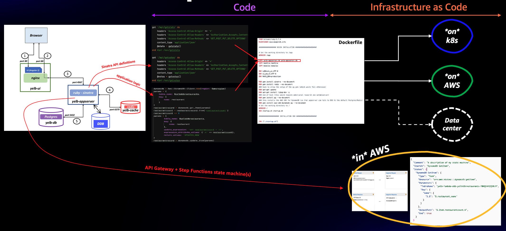
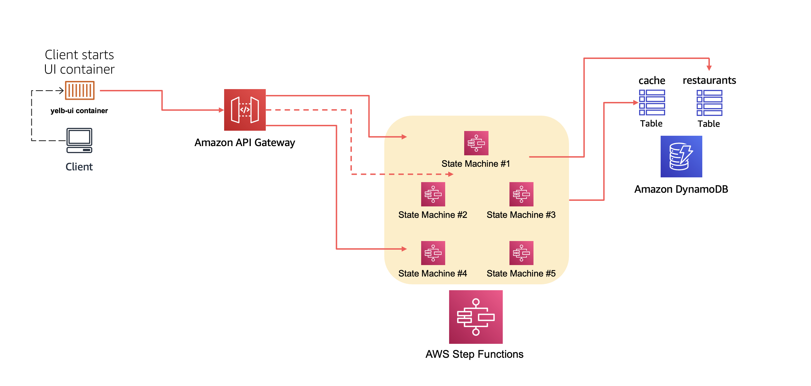

This deployment model allows to get rid completely of the Ruby application server code base. This model implements all the business logic (voting) as AWS Step Functions and exports an API via the AWS API Gateway that is fully compatible with what the Yelb user interface expects to see. 

The way this deployment is packaged is via a CDK construct that does the following: 
- it creates the two DDB tables that the app server already supports in other deployment models
- it initializes said tables via CDK custom resources 
- it creates Step Functions that map in functionalities the Ruby code in the traditional `yelb-appserver` program
- it creates an API Gateway with properly configured resources and methods to map what the Sinatra web framework exposes in the `yelb-appserver` program

This is a visual representation that compares the traditional implementation of the `yelb-appserver` container with the API GW and Step Functions implementation in this repository:

 

You can set up this stack by running `cdk deploy` in this directory. Please read the [CDK Getting Started](https://docs.aws.amazon.com/cdk/v2/guide/getting_started.html) if you are new to CDK.

The output of this action will be something similar to this:
```
Outputs:
StepFunctionsStack.YelbAPIGatewayStepFunctionsEndpoint7C8E30E6 = https://q72oo0igy0.execute-api.us-west-2.amazonaws.com/api/
Stack ARN:
arn:aws:cloudformation:us-west-2:693935722839:stack/StepFunctionsStack/09e15ea0-7494-11ed-8e70-0a329119642b
```
This artifact for now does not include the deployment of the user interface. You are free to deploy the UI component separately taking inspiration from one of the other deployment models in this repo.

The easiest way to test the stack is to launch the `yelb-ui` container on a docker host with the following command:

```
docker run --rm -e YELB_APPSERVER_ENDPOINT=https://q72oo0igy0.execute-api.us-west-2.amazonaws.com -p 8080:80 -d  mreferre/yelb-ui:0.10
```

Note that the `YELB_APPSERVER_ENDPOINT` is set to the endpoint of the API Gateway (which is the CDK output ***without*** the `/api/` path at the end). If you ran the command above on your workstation you can reach the user interface by pointing your browser to `localhost:8080`. All API calls the user interface will make will end up hitting the API Gateway that in turns will trigger the corresponding state machines that backs said APIs.

This is a diagram of the architecture of this setup:


