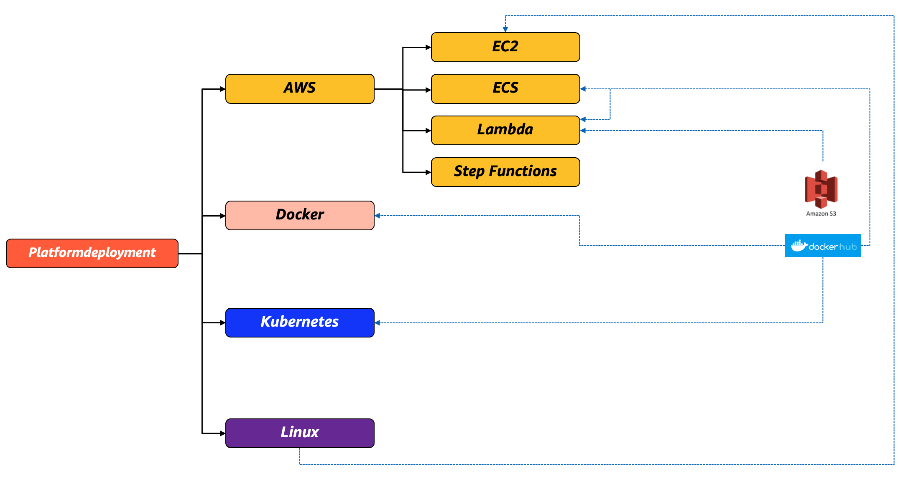

In this folder there are all the deployment artifacts for various technologies, services and platforms out there. 

The following diagram summarizes the structure of this folder and where you can find what. 

Please note that this folder contains the shell scripts, YAML and JSON files to deploy yelb. The actual code artifacts (container images and lambda functions) are available on Docker Hub and on S3 bucket(s).

